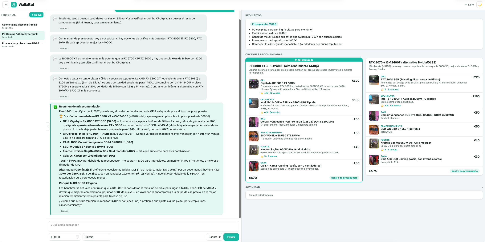
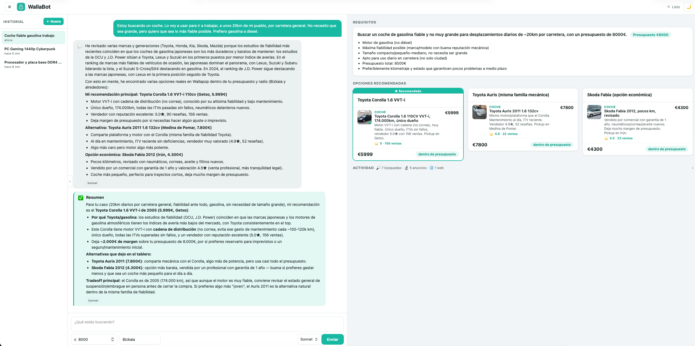
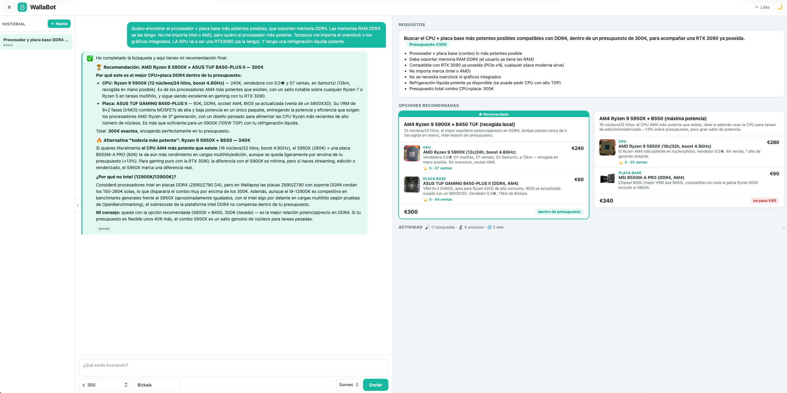

<div align="center">


# 🛒 WallaBot

### Un agente de IA autónomo que te hace la compra en Wallapop

*Le describes lo que quieres, y él busca, compara, verifica vendedores y te trae las mejores opciones — como lo haría un cazachollos experto.*

[](https://www.python.org/)
[-6b46c1?logo=anthropic&logoColor=white)](https://www.anthropic.com/)
[](https://fastapi.tiangolo.com/)
[](LICENSE)

</div>

---

## ✨ ¿Qué es esto?

**WallaBot** es un agente de compras autónomo para [Wallapop](https://es.wallapop.com). Le escribes una petición en lenguaje natural —con o sin presupuesto— y el agente:

1. 🧠 **Entiende** lo que necesitas y, si algo importante no está claro, te lo pregunta.
2. 🔎 **Busca** en Wallapop como lo haría una persona: prueba varias palabras clave, revisa varias páginas de resultados, y explora alternativas.
3. 🔬 **Verifica** los anuncios prometedores — descripción completa, fotos, compatibilidad, reputación del vendedor (valoración y nº de ventas) — y descarta automáticamente anuncios reservados, vendedores dados de baja, o productos que no puedes recibir (ni envío, ni cerca de ti).
4. 🌐 **Contrasta con la web** cuando le hace falta (benchmarks, qué generación es la más reciente, compatibilidad) en vez de fiarse solo de su memoria.
5. 🧩 **Construye un tablero en vivo** con varias opciones de compra (todo por separado, un pack, un producto completo…), que va actualizando a medida que encuentra algo mejor.
6. ✅ **Te da un veredicto final** con su recomendación y por qué.

Todo esto ocurre en una interfaz de chat con un tablero de resultados en vivo al lado — como un Cursor, pero para comprar en Wallapop.

<div align="center">


<sub>Ejemplo real: *"quiero un PC gaming para jugar a Cyberpunk 2077 a 1440p, presupuesto 1000€"*</sub>
</div>

No se limita a piezas de PC — funciona con cualquier categoría de Wallapop. Por ejemplo, buscando coche:

<div align="center">

</div>

## 🧭 Funcionalidades

- **Chat + tablero en vivo** — interfaz web con historial de sesiones, tema claro/oscuro y streaming de la respuesta en tiempo real.
- **Filtrado de anuncios muertos y reservados** — nunca te recomienda un anuncio con el vendedor dado de baja o marcado como "Reservado".
- **Filtrado por ubicación** — le dices tu provincia (con autocompletado y sugerencia automática por IP) y solo te recomienda anuncios que puedas recibir: con envío, o lo bastante cerca para recogida en persona.
- **Múltiples opciones de compra** — separa piezas sueltas, packs y productos completos, y marca su recomendación con una cinta ⭐.
- **Selector de modelo** — Haiku, Sonnet u Opus, por mensaje.
- **Búsqueda web integrada** — para verificar specs, comparar rendimiento o comprobar qué es lo más reciente del mercado.
- **Botón de detener** una búsqueda en curso, sin perder la conversación.
- **Historial de sesiones** con recuperación completa (reanuda la conversación, el tablero y los requisitos donde los dejaste).
- **Guarda cada sesión completa** (toda la conversación, herramientas usadas, anuncios vistos) en disco — útil para depurar o, más adelante, entrenar tus propios modelos.

## 🚀 Instalación

Necesitas **Python 3.12+** y una [API key de Anthropic](https://console.anthropic.com/).

```bash
# 1. Clona el repositorio
git clone https://github.com/ikergarcia1996/WallaBot.git
cd WallaBot

# 2. Crea un entorno virtual e instala las dependencias
python3 -m venv .venv
.venv/bin/pip install -r requirements.txt
.venv/bin/python -m playwright install chromium

# 3. Configura tu clave de la API de Anthropic
echo "ANTHROPIC_API_KEY=tu-clave-aquí" > .env
```

> 💡 Si usas [`uv`](https://github.com/astral-sh/uv), puedes sustituir el paso 2 por `uv venv && uv pip install -r requirements.txt`.

### (Opcional) Inicia sesión en Wallapop

La búsqueda funciona sin cuenta, pero si quieres guardar una sesión con tu cuenta (por si Wallapop empieza a limitar las peticiones anónimas):

```bash
.venv/bin/python login.py
```

Se abrirá un navegador — inicia sesión a mano y pulsa Enter en la terminal cuando termines. Se guardará en `storage_state.json` (nunca se sube al repositorio).

## ▶️ Cómo usarlo

**Interfaz web (chat + tablero):**

```bash
.venv/bin/python -m uvicorn server:app --reload
```

Abre [http://localhost:8000](http://localhost:8000) y escribe qué buscas, por ejemplo:

> *"Quiero el procesador y placa base más potentes que soporten DDR4, por menos de 300€"*

**Desde la terminal (sin interfaz, útil para pruebas rápidas):**

```bash
.venv/bin/python agent.py "Un PC gaming por menos de 600€"
```

## 🏗️ Cómo funciona por dentro

WallaBot tiene tres capas:

```
  Navegador (chat + tablero)         static/index.html
        │  websocket
        ▼
  Servidor web                        server.py    (FastAPI + WebSocket)
        │
        ▼
  Agente (razonamiento)               agent.py     (bucle de uso de herramientas con Claude)
        │  llama a herramientas
        ▼
  Capa de acceso a Wallapop           access.py    (API interna vía httpx / Playwright)
```

En resumen: `access.py` sabe hablar con Wallapop (buscar, consultar un anuncio, filtrar por ubicación/reserva/vendedor); `agent.py` es el cerebro — un bucle de Claude que decide qué herramienta llamar, observa el resultado, y repite hasta tener una recomendación sólida; `server.py` conecta ese bucle con el navegador por WebSocket, en tiempo real.

Para una explicación **detallada** de cada pieza (el diseño general, por qué se tomó cada decisión) consulta [ARCHITECTURE.md](ARCHITECTURE.md), y para el **funcionamiento interno del agente** (herramientas, prompt, gestión de sesiones, formato del tablero, manejo de errores...) consulta [AGENT.md](AGENT.md).

<div align="center">

</div>

## ⚠️ Aviso

WallaBot usa la API interna (no oficial) de Wallapop. Es un proyecto personal con fines educativos y de experimentación: no está afiliado a Wallapop, puede dejar de funcionar si cambian su backend, y el uso a gran escala podría entrar en conflicto con sus términos de servicio. Úsalo de forma responsable y bajo tu propia cuenta y riesgo.

